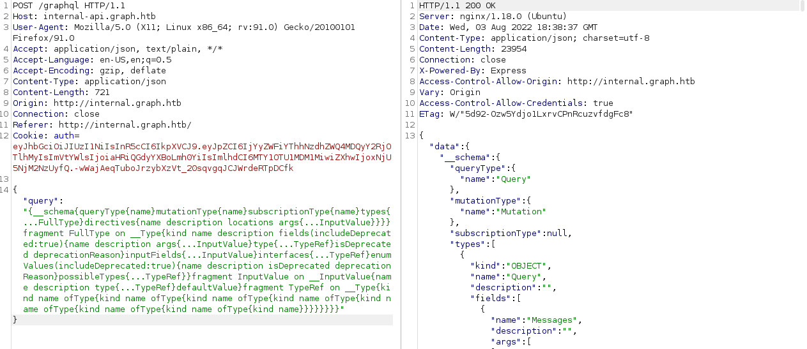
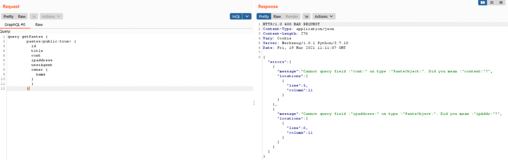

***Source** : https://blog.yeswehack.com/yeswerhackers/how-exploit-graphql-endpoint-bug-bounty/*  
*Box : OverGraph*

History part : GraphQL is a query language developed by Facebook and used internally since 2012, it has been open-source licensed since 2015. From many years, GraphQL has been presented as a good alternative for REST APIs.

# Discovery
It’s difficult to list all possible endpoints to find a GraphQL instance but many of them use a framework like “Appollo” and they use common GraphQL endpoints:  
```language
/v1/explorer
/v1/graphiql
/graph
/graphql
/graphql/console/
/graphql.php
/graphiql
/graphiql.php
(...)
```
You can find more complete list on SecLists. Another way to identify an hidden endpoint by searching some keywords in JavaScripts files like “query“, “mutation“, “graphql” and it could be reveal the presence of GraphQL decommissioned/unofficial endpoint.

## Introspection
Introspection is the ability to query which resources are available in the current API schema. Given the API, via introspection, we can see the queries, types, fields, and directives it supports.  
Payload:  
```sql
{__schema{queryType{name}mutationType{name}subscriptionType{name}types{...FullType}directives{name description locations args{...InputValue}}}}fragment FullType on __Type{kind name description fields(includeDeprecated:true){name description args{...InputValue}type{...TypeRef}isDeprecated deprecationReason}inputFields{...InputValue}interfaces{...TypeRef}enumValues(includeDeprecated:true){name description isDeprecated deprecationReason}possibleTypes{...TypeRef}}fragment InputValue on __InputValue{name description type{...TypeRef}defaultValue}fragment TypeRef on __Type{kind name ofType{kind name ofType{kind name ofType{kind name ofType{kind name ofType{kind name ofType{kind name ofType{kind name}}}}}}}}
```
  
## Fuzzing
Introspection is disabled ? Fuzz! By default, GraphQL backend have a feature for fields and operations suggestions. If you try to query a field but you have made a typo, GraphQL will attempt to suggest fields that are similar to the initial attempt.  
Field suggestions is not a vulnerability, but from hacker’s side, this feature can be abused to gain more insight into GraphQL’s schema, especially when Introspection is not allowed.
  
To perform this suggestion abuse, I highly recommend to use tools.   
- Clairvoyance : https://github.com/nikitastupin/clairvoyance
- GraphQLmap : https://github.com/swisskyrepo/GraphQLmap

# Exploitation
## Query flaws
The principal problem in GraphQL is: by design, you don’t have any control access system, developer has to write “resolvers” which will map the data to the queries for the database of his choice.
Currentuser id can probably modified.
Query are also interesting, as it is sometimes possible to use a legitimate query and add fields to get juicy stuff. 

## Mutation flaws
Mutations are used when web application perform modification actions on data. And like Query, mutations suffers of same problems and can also have others flaws, like mass assignment vulnerability.  
Let’s assume you have a mutation called “registerAccount” which is used by your target to create a simple user account. This mutation have these fields: nickname, email, password.  
In addition, we can also observe that a field “role” is on returned values by GraphQL in “user” object once the mutation is sent.

```nosql
mutation {
    registerAccount(nickname:"hacker", email:"hacktheplanet@yeswehack.ninja", password:"StrongP@ssword!") {
        token {
             accessToken
        }
        user {
           email
           nickname
           role
           } 
       }
    }
}
```
In this case, it’s a good opportunity to see what happen if we add a field “role” in our mutation!
```language
mutation {
    registerAccount(nickname:"hacker", email:"hacktheplanet@yeswehack.ninja", password:"StrongP@ssword!", role:"Admin") {
        token {
             accessToken
        }
        user {
           email
           nickname
           role
           } 
       }
    }
}
```

## SQL injection, debug information, batching attack (brute force and rate-limit bypass)
- SQL Injection: simple but classic, try SQL and NoSQL injection in fields values,
- Debug & information disclosure: Insert bad characters in object or fields name, sometimes DEBUG mode is activated and even if you have a 403 status, you could have a good surprise,
- Batching Attack: Batching is the process of taking a group of requests, combining them into one, and making a single request with the same data that all of the other queries would have made (more here). When authentication process is used with GraphQL, batch attack can be performed to simultaneously sending many queries with different credentials, it’s like a bruteforce attack but only with one request. Also, batch attack can be used against 2FA authentication, to bypass rate-limit (if it’s based on number of query by IP for example).
https://lab.wallarm.com/graphql-batching-attack/ 

# Tools
## GraphQL Voyager
Event if you’re a master of JSON, I think we will be OK to said when you have a GraphQL schema in front of your eyes, to have a clear idea about each object, each mutation and each query, it’s not the simplest.
Source : https://github.com/IvanGoncharov/graphql-voyager 

## InQL (Burp Suite)
nQL is originally a command line tool to facilitate certain attacks against a GraphQL endpoint. Luckily, a Burp Suite extension has also been developed and I recommend you to install it (available in BurpApp Store).

It allows you to directly perform an introspection query (if authorized, of course) and to have all the queries and mutations in Burp, in a readable format.

GitHub repository : https://github.com/doyensec/inql

# Need some training?
If you need to practice with GraphQL before you start digging into your target, I highly recommend using these docker projects “Damn Vulnerable GraphQL Application” and “PoC graphql” which are two great projects available on GitHub. They will allow you to use many different attacks and approaches with GraphQL that I mentioned in this article.

    https://github.com/righettod/poc-graphql
    https://github.com/dolevf/Damn-Vulnerable-GraphQL-Application
