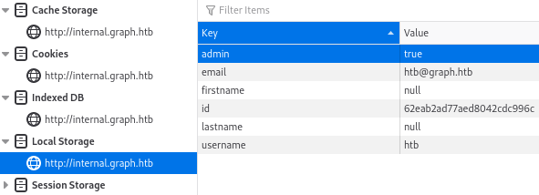

# 1. WEB

# Reconnaissance
## Action à réaliser 
   1. Générer une feuille de note web
   2. Ajouter l'ip / nom de domaine dans /etc/hosts
   2. Lancer en parralèlle les actions de la rubrique "Scanning"
   3. Regarder tous les liens du site
   4. Noter tous les sous domaines
   5. Ajouter tous les sous domaines à /etc/hosts
   6. Si site https, regarder les infos du certificat, nottament la rubrique Issuer qui peut fournir des infos
   7. Relever tout potentiel nom d'utilisateur
   8. Relever le CMS à l'aide de wappalyzer (lien en resssource)
   9. Relever le langage utilisé à l'aide de wappalyzer (lien en resssource)
   10. Relever les services et versions éventuellements

# Scanning & Enumeration
## Scanning 
### Recherche de Vhost
*Prérequis: Dictionnaires SecList - https://github.com/danielmiessler/SecLists.git*   
<code>
gobuster dir -u http://@ip_cible -w /usr/share/SecLists/Discovery/DNS/subdomains-top1million-5000.txt
</code>
Pour chaque Vhost découvert, les ajouter dans /etc/hosts.

### Recherche de répertoires
<code> 
gobuster dir -u http://@ip_cible/dir -w /usr/share/SecLists/Discovery/Web-Content/raft-small-directories.txt
</code>

### Recherche de fichiers
<code>
gobuster dir -u http://@ip_cible -w /usr/share/SecLists/Discovery/Web-Content/raft-small-files.txt
</code>

### Fuzz d'un paramètre
<code>
wfuzz --hh=22 -c -w /usr/share/dirb/wordlists/big.txt http://$target_url/action.php?FUZZ=random
</code>
Options:  
–hh taille de la réponse (quand il y a une erreur) 
-c (Output with colors) 
-w (Wordlist) 
FUZZ (FUZZ keyword will be replaced by the word from the wordlist)

## Enumeration
### Recherche d'entrées utilisateur
Parcourir le site à la recherche d'élément modifiables par l'utilisateur. Ces éléments peuvent être:
- Champs de saisi utilisateur( formulaire, champs de recherche ...)
- Url
- En tête HTTP

# Exploitation (Gaining Access)
## Recherche de vulnérabilités
Pour chaque entrée utilisateur rechercher les éventuelles vulnérabilités:
### Injection SQL

### Injection XSS

### Server Side Template Injection

## Portail d'authentification
Les tests à réaliser sur les portails  d'authentifications sont les suivants:
1. Identifiants de base: admin:admin, identifiants par défaut 
2. Injection SQL
3. Regex pour le champs mot de passe: *
4. Mot de passe oublié 
5. Recherche de fonction register

# Privilege Escalation
## Analyse de la réponse du serveur lors d'une authentification valide.
Certaines informations utiles sont parfois fournie lors du process d'authentification. 
Il peut être possible de 
1. Modifier les droits qui nous sont octroyés.  
2. Modifier le JWT

## Modification des variables locales
 Dans le navigateur la modification de variables peut donner accès à des ressources cachés, voir à des élévations de privilèges.  
   
# Command & Control (Persistence/Maintaining Access)
# Clearing Tracks (usually not necessary in CTF’s, but good practice)

# Resources
https://www.wappalyzer.com/apps 

# Note
Ajouter LFI